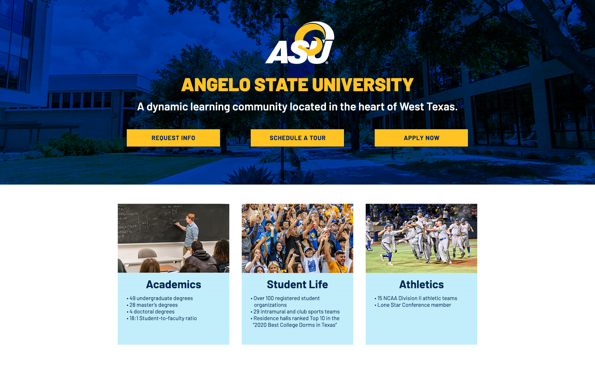

# HTML + CSS Activity

## Assignment

Using the included mockup.jpg and the content on the last page of this document, recreate the image as a web design:

### Acceptance Criteria

* [ ] Write appropriate HTML markup for the provided content.
* [ ] Add CSS to style the HTML appropriately to create the design in the mockup.

### Constraints

* [ ] HTML is well formed and organized.
* [ ] Implemented using modern technique and best practices.
* [ ] Final site followd WCAG 2.2 standards where possible/applicable.
* [ ] Use of Frameworks/libraries is acceptable but not required.
* [ ] Interactive elements and hover states are recommended.
* [ ] OPTIONAL: Implement a responsive layout with support for multiple screen sizes.
* [ ] Final site is published in an online platform to be shared.

### Resources

* Publishing platform: **[Codepen](https://codepen.io.)**
* Logo: [ASU Logo](https://www.angelo.edu/live/resource/image/_i/themes/global/assets/images/asu-logo-white-gold.svg)
* Main background photo: **[BG-Image](https://www.angelo.edu/live/image/gid/315/width/2000/45797_Mall_Between_Archer__CHP.jpg)**
* Academics: [Lecture Hall Photo](https://www.angelo.edu/live/image/gid/315/width/600/height/400/crop/1/41765_COM_3949.jpg)
* Student Life: [Sporting Event Photo](https://www.angelo.edu/live/image/gid/315/width/600/height/400/crop/1/55387_SCT_0033.jpg)
* Atheltics: [Baseball Team Photo](https://www.angelo.edu/live/image/gid/315/width/600/height/400/crop/1/49730_20220528_Rams_vs_CMU_Game_3_South_Central_Super_Regional_0039.JPG)
* Font: [Barlow](https://fonts.googleapis.com/css2?family=Barlow:ital,wght@0,100;0,200;0,300;0,400;0,500;0,600;0,700;0,800;0,900;1,100;1,200;1,300;1,400;1,500;1,600;1,700;1,800;1,900&display=swap)

### Colors

Gold: hex #ffc423, rgba(255, 196, 35, 1)

Light Blue: hex #c1edfb, rgba(193, 237, 251, 1)

Text: hex #002554, rgba(0, 37, 84, 1)

Background Overlay:  hex #003fb0, rgba(0, 37, 84, 1), background-blend-mode: multiply
